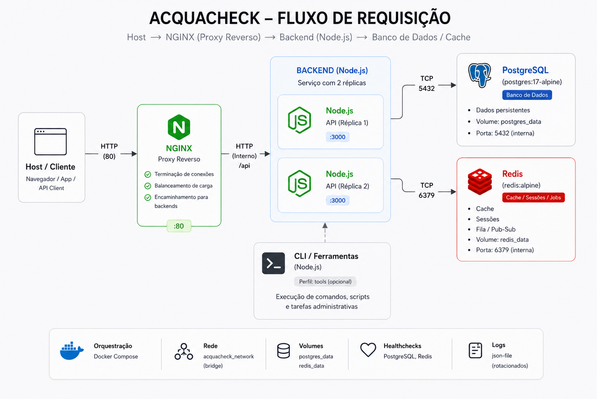

# AcquaCheck API

O **AcquaCheck** é uma API RESTful desenvolvida em Node.js para a gestão e inspeção de parques aquáticos. O sistema permite o gerenciamento completo de checklists de segurança e atrações, operando sob rigorosos padrões de arquitetura e infraestrutura conteinerizada.

---

## 🛠️ Tecnologias Utilizadas

A aplicação backend foi desenhada para atender (e superar) os requisitos técnicos de desenvolvimento web moderno:

- **Plataforma:** Node.js v24+
- **Servidor HTTP:** Express
- **Banco de Dados:** PostgreSQL 17+
- **ORM:** Sequelize (com driver pg)
- **Autenticação:** JWT (JSON Web Tokens) com senhas encriptadas via `bcryptjs`
- **Controle de Sessão Avançado:** Redis (Blacklist de Tokens de Logout)
- **Documentação:** Swagger (`swagger-ui-express`)
- **Infraestrutura:** Docker e Docker Compose

---

## Arquitetura do Sistema e Containers



A aplicação roda em um ambiente completamente conteinerizado, respeitando o princípio de isolamento e segurança perimetral. A arquitetura segue o fluxo restrito:

**`Host -> Nginx -> Node Web Server -> PostgreSQL`**

O servidor Node.js é **privado**, sem acesso direto pelo host. O tráfego externo passa única e exclusivamente pelo Nginx, que atua como Proxy Reverso.

### Containers em Operação (`docker-compose.yml`):

1. **`db_acquacheck`**: Container rodando a imagem oficial do PostgreSQL 17 (Armazenamento de dados transacionais).
2. **`redis_cache`**: Container rodando o Redis (Usado pelo Middleware de Segurança para armazenar a _Blacklist_ de JWTs após o logout).
3. **`backend`**: Cluster rodando as réplicas do Node.js Web Server (Onde a API reside).
4. **`nginx`**: Container proxy-reverso escutando a porta 80 e roteando para o Web Server.
5. **`cli`**: Container utilitário configurado como _entrypoint_ (CLI Node.js) exclusivo para a execução de tarefas administrativas, como rodar migrations e seeds.

---

## Como Funciona o Servidor (PASSO A PASSO OBRIGATÓRIO)

Para subir toda a infraestrutura da API do absoluto zero, siga as instruções abaixo rigorosamente:

### 1. Configurando os Segredos

Antes de rodar a aplicação, você precisa definir as variáveis de ambiente base:

1. Navegue até a pasta `backend/`.
2. Renomeie (ou duplique) o arquivo `.env.example` para `.env`.
3. Mantenha as configurações padrões que já estão lá. Elas coincidem com as credenciais que o Docker Compose criará.

### 2. Subindo a Arquitetura (Automação CI/CD)

Na **raiz do projeto**, nós fornecemos um script oficial de automação (`deploy.sh`) que orquestra todo o ambiente de forma contínua e segura. Ele limpa volumes antigos, constrói a imagem de forma otimizada (`npm ci`), aguarda o *healthcheck* do PostgreSQL e roda as migrations automaticamente.

Basta executar no seu terminal (Git Bash, WSL, Linux ou Mac):

```bash
bash deploy.sh
```

**Alternativa: Subida Manual Passo a Passo**

Se você preferir rodar os processos manualmente sem a automação do script, é altamente recomendado limpar os volumes e redes antigas antes de iniciar a nova compilação:

```bash
docker-compose down -v
docker-compose up -d --build
```

### 3. Migrations Automáticas vs Manuais

No AcquaCheck, programamos o backend para executar automaticamente as migrations e os seeders ao subir o contêiner pela primeira vez. Entretanto, caso queira executá-los **manualmente** pelo nosso entrypoint de command line (CLI), o comando documentado é:

```bash
docker-compose run --rm cli migrate
```

**Outros comandos CLI disponíveis:**

- `docker-compose run --rm cli migrate:undo` (Desfaz a última migration)
- `docker-compose run --rm cli seed` (Popula a base com o admin)

---

## Modelagem, CRUD e Autenticação

A arquitetura do banco suporta a regra de negócios via Sequelize e contempla o mínimo de 4 tabelas, incluindo uma relação "Muitos-para-Muitos" (N:N) com sua respectiva tabela pivô (todas com Models independentes).

Temos as rotas completas de **CRUD (Create, Read, Update, Delete)** cobrindo as 5 manipulações básicas para as entidades.

### 📋 Entidades e Regras de Negócio (Endpoints)

A API modela o ecossistema real de segurança de um parque aquático, possuindo regras operacionais específicas:

1. **Usuários (`/users`)**
   - **Regra de Segurança:** A rota de criação (`POST /users`) não é pública. Diferente de um e-commerce, um funcionário não "cria sua própria conta". Ele deve ser **cadastrado por um Administrador**. Isso garante o controle de acesso irrestrito aos sistemas de vistoria.

2. **Atrações (`/attractions`)**
   - **Controle Operacional:** Representa as estruturas físicas do parque (Toboáguas, Piscinas).
   - Permite que o parque adicione novos equipamentos, altere status (ex: Manutenção) ou os desative.

3. **Questões (`/questions`)**
   - **Base de Conhecimento:** Banco de perguntas técnicas padronizadas (ex: *"O nível de cloro está adequado?"*, *"As travas de segurança estão firmes?"*).

4. **Checklists e Tabela Pivô (`/checklists`)**
   - **O Coração da Aplicação:** É a entidade que garante a rastreabilidade diária. Um inspetor abre um *Checklist* atrelado a uma Atração específica.
   - **Relação N:N (ItemChecklist):** Através da nossa tabela pivô, vinculamos *várias Questões* a um único *Checklist*, armazenando a resposta exata da vistoria daquele dia. Isso previne acidentes e serve como auditoria legal.

### Como Logar e Usar o Token JWT

Quase todas as rotas da aplicação são protegidas por autenticação.

1. **Faça o Login:**
   Envie um `POST` para `http://localhost/api/login` (ou pela interface do Swagger) contendo o payload:
   ```json
   {
     "email": "admin@acquacheck.com",
     "password": "31599499"
   }
   ```
2. **Capture o Token JWT:**
   A resposta HTTP será um JSON contendo a propriedade `token`.
3. **Use o Token nas Requisições Seguintes:**
   Para acessar rotas privadas, injete o token no cabeçalho (_Header_) `Authorization` utilizando o formato Bearer:
   ```http
   Authorization: Bearer <SEU_TOKEN_JWT_AQUI>
   ```

_Nosso sistema também possui um **Middleware customizado** altamente robusto: ao fazer logout (`POST /logout`), o token utilizado é capturado, e o tempo de expiração (`exp`) restante é calculado com precisão e injetado no Redis. O middleware intercepta conexões bloqueando instantaneamente qualquer token que esteja nessa Blacklist._

---

## Documentação (Swagger & Postman)

Documentamos toda a API visualmente, permitindo explorar o CRUD completo (List, Get, Create, Update, Delete) de cada entidade.

- **Rota da Documentação Swagger (Obrigatória):**  
  Acesse no seu navegador: **`http://localhost/api/api-docs/`**
- **Postman Collection (Bônus):**
  Na pasta `postman/` deste repositório encontra-se o arquivo `AcquaCheck_API.postman_collection.json`. Você pode importá-lo diretamente no Postman ou Insomnia para ter acesso imediato a todas as requisições configuradas.
